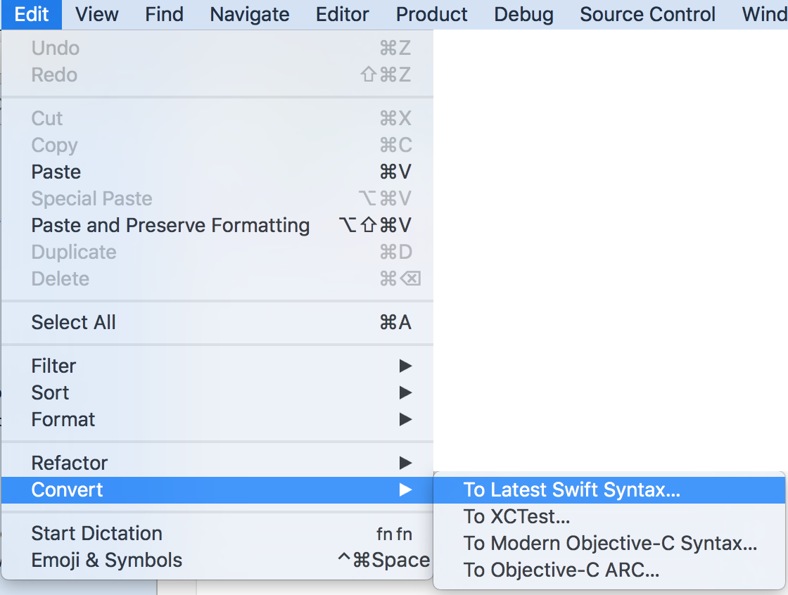
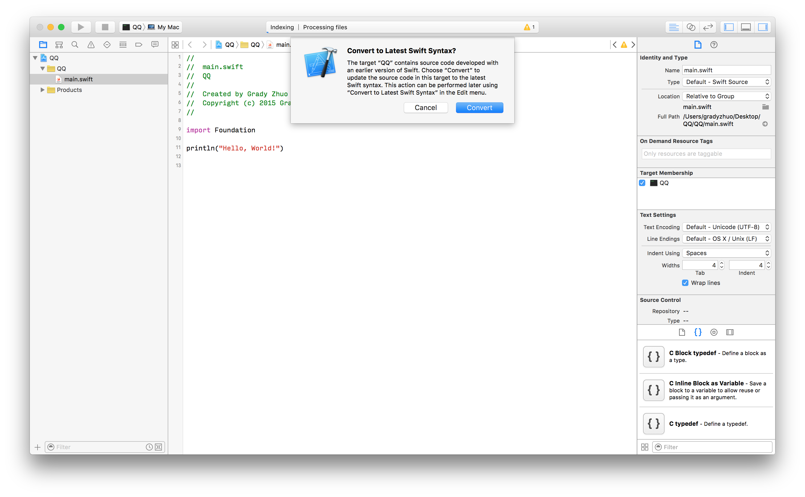
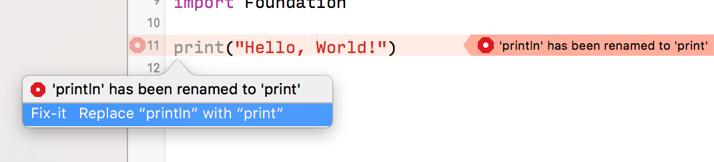
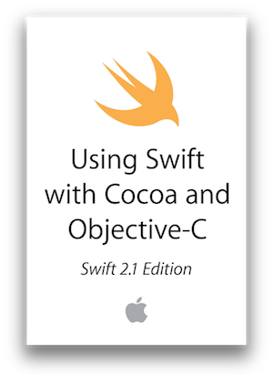

# 序章 - 經驗談

#### 1. Swift Syntax Convertor
從Xcode 6.x開始，就內建了**Swift**版本升級的**語法轉換器**，
位置在**Edit**->**Convert**->**To Last Swift Syntax...**， 可自動轉換成最新的Swift語法，建議轉換的Swift的版本不要超過2版，也就是**Swift 1.2->2.0** 或是 **Swift 1.1->2.0**，盡量不要S**wift 1.0->2.0**，問題可能會不少…，最好是有新的就轉上去。



###### 小插曲：
    當初Swift 1.1 -> 1.2(Xcode 6.3 beta) 的時期，
    本來Covert的選項是叫 Convert To Swift 1.2。
    結果Xcode才過一個beta版本，就改名了XD，
    改叫To Last Swift Syntax..., 由此可見，Apple也覺得會一直改版，
    也不想一直改Xcode的選項吧XD。

#### 2. Swift的版本跟 **Xcode版本** 很密切，升到新語法就回不去了！

每當Xcode更新新版，如果想透過新版Xcode測試現在專案於新的SDK編譯下是否正常運作，整個專案Swift版本就必須只能升上去…

不只升級Swift會遇到重重困難，好不容易修改好的Swift語法，也不再容易降級，因為Xcode內建的**語法轉換器**，只能從前幾版更新到現在Xcode支援的版本，但沒有做降版的轉換器。

而原本的Xcode也再也無法辨識最新的語法了，就這樣…"**瑞凡，我回不去了**"。

##### [例] Xcode 6.4 (Swift 1.2) 與 Xcode 7.x (Swift 2.x) 的抉擇
    Xcode 7.0不支援iOS 7.0的模擬器，
    如果現在在Xcode 6.4開發，又想在Xcode 7.0測試看看Code是否正常，
    就發生了Swift在兩個版本間會無法自在轉換，
    就只能等到確定要升到Xcode 7.0的時候, 才一次轉換上去，不然過程中先轉都是做白工。



#### 3. Swift upgrade時，改Syntax是常有的事~
Swift就像還在成長的小燕子，還有很多成長的空間，因此，Apple在這個過程會不斷的修改語法，甚至導入新的「程式設計原則」**(e.g. Protocol Oriented Programming)**，在這個過程一定會透過**語法轉換器**轉換現在的語法，有的syntax erro或許可以自動convert過去，但不能convert的，就只能手動修改…(我改過快100個Error…)。

 


#### 4. 魔燕成長太快，無法有實體書參考輔助…

現在的除非是電子書，不然Swift迭代更新的太快，每3個月一次大改，目前市面上沒有一本書可追上Swift的更新速度，所以大多還是以官方的iBooks或是網頁的Docuemtn為主。

 
* 紅色：**純Swift語法**


* 黃色：**ObjC到Swift的相容開發注意事項**


#### 5. C Pointer使用上變複雜了！

現在要透過
```swift
UnsafePointer
UnsafeMutablePointer
UnsafeBufferPointer
UnsafeMutableBufferPointer
```
來操作指標，看名字就知道Apple認為Pointer有多**Unsafe了**吧。(誤

``` 
e.g.在C語言中，一個 C Array 可以這樣寫，那Swift如何做出一個C Array呢？

NSInteger index[4] = {0, 1, 2, 3};

printf("%ld, %ld, %ld, %ld\n", index[0], index[1], index[2], index[3]);
```
### 方式一，對Address一個一個賦值

```swift
//先決定一個開始的address位置
let start = UnsafeMutablePointer<Int>.alloc(0)
start.initialize(0)

//給定開始的address位置，和elemets的數量，以生成BufferPointer
let cArray = UnsafeMutableBufferPointer<Int>(start: start, count: 4)

//賦值，較早期的寫法
let index0 = cArray.baseAddress
index0.initialize(0)
let index1 = index0.successor()
index1.initialize(2)
let index2 = index1.successor()
index2.initialize(4)
let index3 = index2.successor()
index3.initialize(8)

print(index0.memory, index1.memory, index2.memory, index3.memory)
```

### 方式二，使用後期UnsafeMutableBufferPointer加入的subscript

```swift
//先決定一個開始的address位置
let start2 = UnsafeMutablePointer<Int>.alloc(0)
start2.initialize(0)

//給定開始的address位置，和elemets的數量，以生成BufferPointer
let cArray2 = UnsafeMutableBufferPointer<Int>(start: start2, count: 4)

cArray2[0] = 0
cArray2[1] = 1
cArray2[2] = 2
cArray2[3] = 3

print(cArray2[0], cArray2[1], cArray2[2], cArray2[3])
```
### 雖然看起來坑不少…
### 但我還是要推薦大家使用Swift！ Why?

#### 6. Swift 即將Open Source，upgrade 幅度便會開始收斂

雖然還不是很明顯，但現在距離Swift Open Source的時程已經相當接近，而且從Swift 1.2 開始，看的出來 Swift正在脫離Cocoa 框架。

而且Apple應該是不至於在OpenSource後，還大幅更改Syntax…
    
* 可以到Swift的Blog，在Swift 2.0那一篇有提到OpenSource喔~
[Swift2.0 in Swift Blog by Apple Inc. ](https://developer.apple.com/swift/blog/?id=29)


#### 7. Swift可以寫出相較Objective-C安全的code

先來看看Apple官方如何簡述Swift：

```Swift. A modern programming language that is safe , fast, and interactive.```
    
因此Swift較多的語法限制都是為了避免寫出不安全的Code:
* **Optional**(第四章會說明)
* **if**不能沒有{}
* **Switch**預設**case**不穿透
* 不容易使用**Pointer**


#### 8. 語法日趨完備

Swift現在還在完備他的語法與基礎型別，從2.0開始，Swift已可見獨立的決心，並導入自有的程式設計模式，且從Opensource釋出的Swift 3.0目標，Apple已經確定會在2016年秋季推出Swift 3.0時，會完全脫離Foundation的約束，成為完全獨立的語言，另外Swift Opensource後的所有改變與發展都會攤在陽光下，可以提前知道有什麼樣的改變，相信現在已經是可以開始嘗試的時機了。

#### 9. 未來發展 ? 

由於Swift已經Open Source到Linux平台，以及Swift的在語法上與Script Language借鏡不少，加上Apple在LLVM上提供Swift一個有如直譯器的環境。可以看得出來Swift在靈活度將比Objective-C更高，更有彈性。

雖然現在Swift跟Cocoa的關係還是很緊密，但可以預見的是，未來在Linux平台(甚至更多平台)也可以使用Swift開始寫一些工具。由於Linux是**嵌入式系統**和**伺服器**首選之一，因此或許嵌入式系統，也或許是可以做為Server的處理語言，都是未來可能可以發展的方向。

#### 10. Obj-C 與 Swift 的抉擇?
    
真的要說的話，現在如果沒有學過Objective-C的人，Swift現在還不是市場驗證最好的時機，但卻已經是可以開始學習的時機。

因為語法日趨完備，因此變動的幅度也不至於無法掌握。但現在大多數專案還是會要求Objective-C，所以無法保證不會接觸到Objective-C，但不論是開發iOS/OSX，其CocoaTouch/Cocoa Frameworks的介面操作都是相同，所以在切換的過程應不至於太困難。

不過，如果還是會顧忌的朋友，那我還是會建議先從Objective-C開始，畢竟現在大環境還是以Objective-C為主，不過這個現象很快就會改變了。

另外，多了解一個語言亦不是壞事，語法都只是轉換習慣的問題。


---


#### 在經驗談的最後，祝大家在未來的Swift之路上都可以一路順利，發現更多Swift的設計之美~亦與大家共勉之😉。
    
    