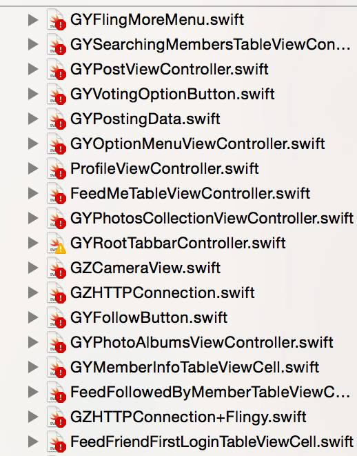
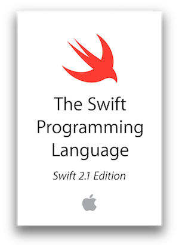

# 序章 - 經驗談

## 1. Swift Syntax Convertor
從 Xcode 6.x 開始，就內建了 **Swift** 版本升級的**語法轉換器**，
位置在 `Edit -> Convert -> To Last Swift Syntax ...` ， 可自動轉換成最新的  Swift 語法，建議轉換的 Swift 的版本不要超過2版，也就是 **Swift 1.2 -> 2.0** 或是 **Swift 1.1 -> 2.0** ，盡量不要 **Swift 1.0 -> 2.0** ，問題可能會不少，最好是有新的就轉上去。


> ##### 小插曲：

> ###### 當初Swift 1.1 -> 1.2(Xcode 6.3 beta) 的時期，本來Covert的選項是叫 Convert To Swift 1.2。結果Xcode才過一個beta版本，就改名了XD，改叫To Last Swift Syntax..., 由此可見，Apple也覺得會一直改版，也不想一直改Xcode的選項吧XD。


## 2. Swift 的版本跟 * *Xcode 版本** 很密切，升到新語法就回不去了！

每當 Xcode 更新新版，如果想透過新版 Xcode 測試現在專案於新的 SDK  編譯下是否正常運作，整個專案 Swift 版本就必須只能升上去…

不只升級Swift會遇到重重困難，好不容易修改好的Swift語法，也不再容易降級，因為Xcode內建的**語法轉換器**，只能從前幾版更新到現在Xcode支援的版本，但沒有做降版的轉換器。

而原本的 Xcode 也再也無法辨識最新的語法了，就這樣「**瑞凡，我回不去了**」。

##### [例] Xcode 6.4 (Swift 1.2) 與 Xcode 7.x (Swift 2.x) 的抉擇
    Xcode 7.0 不支援 iOS 7.0 的模擬器，
    如果現在在 Xcode 6.4 開發，又想在 Xcode 7.0 測試看看 Code 是否正常，或想及早測試是否導入某個新版 iOS Feature
    就發生了 Swift 在兩個版本間會無法自在轉換，
    就只能等到確定要升到 Xcode 7.0 的時候, 才一次轉換上去，不然過程中先轉都會變成做白工。


## 3. Swift upgrade 時，改 Syntax 也是常有的事~
Swift就像還在成長的小燕子，還有很多成長的空間，因此，Apple在這個過程會不斷的修改語法，甚至導入新的「程式設計原則」 **(e.g. Protocol Oriented Programming)** ，在這個過程一定會透過**語法轉換器**轉換現在的語法，有的syntax erro或許可以自動convert過去，但不能convert的，就只能手動修改…(我改過快100個Error…)。

目前 Swift 3.0 已預計在 2016 fall 面市，且最重要的目標就是脫離 Fundation ，這也代表 Swift 要等到明年秋季才會穩定，過程還會有幾次大改。

 


## 4. 魔燕成長太快，無法有實體書參考輔助…

現在的除非是電子書，不然 Swift 迭代更新的太快，約每3個月一次大改，目前市面上沒有一本書可追上 Swift 的更新速度，所以大多還是以官方的 iBooks 或是網頁的 Docuemtn 為主 (詳情可看本書介紹，附有連結) 。


 
* 紅色：**純 Swift 語法**


* 黃色： **Objective-C 到 Swift 的相容開發注意事項**


## 5. C Pointer使用上變複雜了！

現在要透過
```swift
UnsafePointer
UnsafeMutablePointer
UnsafeBufferPointer
UnsafeMutableBufferPointer
```
來操作指標，看名字就知道 Apple 認為 Pointer 有多 **Unsafe了** 吧。(誤

``` 
e.g.在C語言中，一個 C Array 可以這樣寫，那Swift如何做出一個C Array呢？

NSInteger index[4] = {0, 1, 2, 3};

printf("%ld, %ld, %ld, %ld\n", index[0], index[1], index[2], index[3]);
```
### 方式一，對 Address 一個一個賦值

```swift
//先決定一個開始的address位置
let start = UnsafeMutablePointer<Int>.alloc(0)
start.initialize(0)

//給定開始的address位置，和elemets的數量，以生成BufferPointer
let cArray = UnsafeMutableBufferPointer<Int>(start: start, count: 4)

//賦值，較早期的寫法
let index0 = cArray.baseAddress
index0.initialize(0)
let index1 = index0.successor()
index1.initialize(2)
let index2 = index1.successor()
index2.initialize(4)
let index3 = index2.successor()
index3.initialize(8)

print(index0.memory, index1.memory, index2.memory, index3.memory)
```

### 方式二，使用後期 UnsafeMutableBufferPointer 加入的 subscript

```swift
//先決定一個開始的address位置
let start2 = UnsafeMutablePointer<Int>.alloc(0)
start2.initialize(0)

//給定開始的address位置，和elemets的數量，以生成BufferPointer
let cArray2 = UnsafeMutableBufferPointer<Int>(start: start2, count: 4)

cArray2[0] = 0
cArray2[1] = 1
cArray2[2] = 2
cArray2[3] = 3

print(cArray2[0], cArray2[1], cArray2[2], cArray2[3])
```
### 雖然看起來坑不少…
### 但我還是要推薦大家使用 Swift! Why?

## 6. Swift 可以比 Objective-C 安全，且執行快速

先來看看 Apple 官方如何簡述 Swift ：

```Swift. A modern programming language that is safe , fast, and interactive.```
    
因此Swift較多的語法限制都是為了避免寫出不安全的Code:
* **Optional** (第四章會說明)
* **if** 不能沒有{}
* **Switch** 預設 **case** 不穿透
* 不容易使用 **Pointer**


## 7. 語法日趨完備

Swift 現在還在完備他的語法與基礎型別，從 2.0 開始， Swift 已可見獨立的決心，並導入自有的程式設計模式，且從 Opensource 釋出的 Swift  3.0 目標， Apple 已經確定會在2016年秋季推出Swift 3.0 時，完全脫離 Foundation Framework 的約束，,也就是不會再出現 NS 前綴的 Class ，成為完全獨立的語言，另外 Swift  Opensource 後的所有改變與發展都會攤在陽光下，可以提前知道有什麼樣的改變，相信現在已經是可以開始嘗試的時機了。

## 8. 未來發展 ? 

由於 Swift 已經 Open Source ，以及 Swift 的在語法上與 Script Language 借鏡不少，再加上 LLVM 提供了 Swift 一個有如直譯器的執行環境。使得 Swift 在靈活度都將比 Objective-C 更高，更有彈性。

雖然現在 Swift 跟 Foundation Framework 的關係還是很緊密，但可以預見的是，未來在 Linux 平台(甚至更多平台)也可以使用 Swift 開始寫一些工具。又加上 Linux 是目前**嵌入式系統**和**伺服器**首選之一，因此或許嵌入式系統，也或許是可以做為 Server 的處理語言，都是未來可能可以發展的方向。

## 9. Obj-C 與 Swift 的抉擇?
    
真的要說的話，現在如果沒有學過 Objective-C 的人， Swift 現在還不是市場驗證最好的時機，但卻已經是可以開始學習的時機。

因為語法日趨完備，因此變動的幅度也不至於無法掌握。但現在大多數專案還是會要求 Objective-C ，所以無法保證不會接觸到 Objective-C ，但不論是開發 iOS/OSX ，其 CocoaTouch / Cocoa Frameworks 的介面操作都是相同，所以在切換的過程應不至於太困難。

不過，如果還是會顧忌的朋友，那我還是會建議先從 Objective-C 開始，畢竟現在大環境還是以 Objective-C 為主，不過這個現象很快就會改變了。

另外，多了解一個語言亦不是壞事，語法都只是轉換習慣的問題。


---


#### 在經驗談的最後，祝大家在未來的Swift之路上都可以一路順利，發現更多Swift的設計之美~亦與大家共勉之😉。
    
    