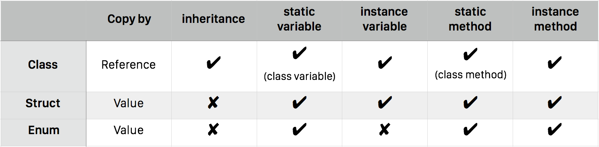
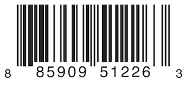

# 第一章 - Class, Struct and Enum的抉擇

### Class, Struct and Enum的比較表


### 其他共同的性質
1. 都可實作Protocol
2. 都可使用extension，擴充method
3. 都可以使用泛型(Generic)
---

## 🔦Class
### 簡易宣告

```swift
class AddressClass {
    //等於Objective-C的 @property (strong) NSString *city;
    var city:String = ""
    var road:String? = ""
    
    //一個Class的宣告，在有效的Scope內預設就會有 init
    //init(){
    //
    //}
}

//標準的建構AddressClass的物件
let address = AddressClass()

```

### 較完整的宣告
```swift
class Person {
    //Class Variable 在 Swift 中同Java，採用static保留字宣告
    static let isAnimal:Bool = true
    
    var hairColor:String
    var name:String
    
    //可自定義指定建構式所需要傳入參數
    init(name:String, hairColor: String){
        self.hairColor = hairColor
        self.name = name
    }
    
    //加入method
    func say(){
        print("what?")
    }
    
    func dothing(){
        print("no thing")
    }
}

//透過自定義的建構式，建構Person的物件
let person = Person(name: "Peter", hairColor: "Black")
person.hairColor //Black
person.name //Peter
```

###繼承, 保留原本的，並增加建構子
```swift
class TaiwanBaby:Person {
    
    //透過convenience定義的建構式可以呼叫此class其他的建構式
    convenience init(name: String) {
        //這裡使用的是self，而不是super
        self.init(name: name, hairColor: "Black")
        
    }
    
    //從parent來的variable/method/constructor都需加上override
    override func say() {
        super.say()
        
        print("I'm \(name)")
    }
    
}

//使用TaiwanBaby特有的建構式建構物件
let taiwanBaby = TaiwanBaby(name: "James")
taiwanBaby.name //James
taiwanBaby.hairColor //Black

//使用來自Person的建構式建構物件
let yellowHairBaby = TaiwanBaby(name: "Kai", hairColor: "Yellow")
yellowHairBaby.name //Kai
yellowHairBaby.hairColor //Yellow
```
###繼承, 並限制建構子
```swift
class Grady : Person {
    
    //自定義建構式 (designated initializer)
    //在Swift中，如果自身已指定 designated initializer 
    //預設對外的介面就不再延續來自SuperClass的initializer
    init(){
        super.init(name: "Grady", hairColor: "Brown")
    }
    
    override func dothing() {
        print("coding")
    }
}

let grady = Grady()
grady.say()
grady.dothing()
```

### Class 是 Copy by Reference
```swift
let grady2 = grady
grady2.name = "Grady 2"

grady.name //Grady 2, 原本的grady的name就被改變了
```
---
## 🔦Struct
###以往使用Struct的方式

```c 
struct CTypeStruct{
    NSString * property1;
    NSString * property2
}

//要額外寫function去處理struct的操作
CTypeStruct CTypeStructMake(NSString *str1, NSString *str2){
    return {str1, str2};
}

//struct在使用上就跟Swift差不多
CTypeStruct s = CTypeStructMake(@"Hello", @"world")
s.property1
s.property2
```
###Swift的Struct
```swift
struct SwiftTypeStruct {
    var property1:String
    //可以設定readonly屬性
    let readonlyProperty:String
    
    // 可客制建構式
    init(custom1:String, custom2: String){
        self.property1 = custom1
        self.readonlyProperty = custom2
    }
    
    init(){
        self.property1 = ""
        self.readonlyProperty = ""
    }
    
    // 可加上method
    func stringsPlus()->String{
        return self.property1 + " + " + self.readonlyProperty
    }
    
    // 若想修改屬性的method，需加上mutating 
    // 放心，忘了加，Xcode會提醒你
    mutating func property1Add(other:String){
        self.property1 += other
    }
    
}

var struct2 = SwiftTypeStruct(custom1: "Hello", custom2: "World")
struct2.stringsPlus()
struct2.property1Add(" everyone, and ")
struct2.stringsPlus()
```

### Struct 是 Copy by value
```swift
var copyStruct = struct2
copyStruct.property1 = "This is"
struct2.property1 //不會改變
```

### Swift的Struct還可以實作Protocol
```swift
struct Dog : Speakable {
    //由Speakable定義需實作的的method
    func say() {
        print("汪")
    }
}
```

## 🔦Enum
### 以往的使用方式

```c
enum ColorType : Int {
    case Red = 0
    case Black = 1
}
```

```swift
let color = ColorType.Black
//如果assign的變數有宣告，也可以縮寫
let color2:ColorType = .Red
//比較常會用在傳遞變數時使用
func getColorName(color:ColorType)->String{
    //do something
    switch color {
    case .Black:
        return "Black"
    case .Red:
        return "Red"
    }
}

let typeName = getColorName(ColorType.Black) //Black
let type = ColorType.Black //Black

```
### Swift 的Enum可以指定Int以外的型別 (e.g. String)

```swift
enum Color : String {
    case Red = "Red"
    case Black = "Black"
    
    //無法放置可儲存的variable
    //但可以做一個readonly的變數 (這個寫法是getter, 未來會說明)
    //或是加上之前講過的AssocicateObject
    var name:String{
        return self.rawValue
    }
    
    //可以加上Method，把一些處理包在Enum裡
    func getUIColor()->UIColor{
        switch self {
        case .Black:
            return UIColor.blackColor()
        case .Red:
            return UIColor.redColor()
        }
    }
}

let color3 = Color.Red
color3.rawValue //可以直接取出rawValue
color3.name
color3.getUIColor()
//也可以透過建構式
let color4 = Color(rawValue: "Red") ?? Color.Red
//但如果不存在的就會回傳nil
let color5 = Color(rawValue: "Yellow")


//如果在已知型別的情況下, 可省略ColorType
let type = ColorType.Black
let type2 : ColorType = .Black

let colorName = getColorName(.Black) 
```

### Swift 的 Enum **終極用法**

只有Swift 才有的特性! Associated Values (關聯值)

不同於C或許多語言的enum, 不寫case type預設就int

Swift的enum，可以不寫case型別，甚至可以當"**容器**"。
```swift
//宣告一個名為Package的Enum，包含3個case
enum Package {
    // Nothing 代表沒東西
    case Nothing
    // SomeInteger 可設定1個integer的關聯值
    case SomeInteger(integer:Int)
    // TwoDoubles 可設定2個double的關聯值
    case TwoDoubles(double1: Double, double2: Double)
    
    // 宣告一個function, 做為判斷關聯值是否為整數值
    // 是 : 回傳 true
    // 否 : 回傳 false
    func containInteger()->Bool{
        switch self{
        case .Nothing:
            return false
        case let .SomeInteger(integer):
            return true
        case let .TwoDoubles(_, _):
            return false
        }
    }
}


let nothing = Package.Nothing
nothing.containInteger() //false
let integer = Package.SomeInteger(integer: 30)
integer.containInteger() // true
```

甚至可以在Array中使用enum達成**指定的多型別Array**的操作，讓Array可以不似[AnyObject]捉摸不定，可以明確的指定型別又可以放超過一種型別。

```swift
var packages = [Package]()

//[Package]就表示是一個可以放兩種型別(Int&Double)的Package Array
packages.append(.TwoDouble(double1: 40.0, double2: 80.0))
packages.append(.SomeInteger(integer: 20))
```

### Apple的例子：Barcode
```swift
// 宣告一個Barcode的enum，裡面有2個case
enum Barcode {
    // UPCA : 二維碼，存放3個Associated Values
    case UPCA(Int, Int, Int)
    // QRCode : 直接存放一個解析後的Associated Value字串
    case QRCode(String)
}
```
#### 二維碼實例：



```swift
let barCode = Barcode.UPCA(8, 8590951226, 3)
```

#### QR Code實例：

```swift
let qrCode = Barcode.QRCode("Example")
```
