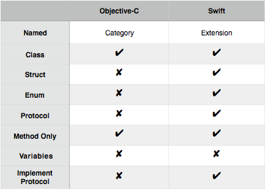

# 第二章 - 無所不能的Extension

[表二] Objective-C(Category) 與 Swift(Extension) 的比較


- **Extension** 等價於 **Objective-C** 的 **Category**
- **Category**只能作用於**Class**，**Extension**則是所有東西皆可Extend，進行擴充。
- **Extension**的語法，較**Objective-C**å更為簡單易寫。

---
### 基本的Extension使用方式

```swift
import Foundation

extension NSURL {
    func getParams()->[String:String]{
        
        let components = NSURLComponents(URL: self, resolvingAgainstBaseURL: false)
        
        //取出items，如果為nil就改為預設值 空陣列
        let queryItems = components?.queryItems ?? []
        
        return queryItems.reduce([String:String](), combine: { (var dict, item) -> [String:String] in
            dict[item.name] = item.value ?? ""
            return dict
        })
        
    }
}

let url = NSURL(string: "http://host/?first=grady&last=zhuo&github=1")
url?.getParams()
```

### 對現有型態進行擴充

```swift
extension Int {
    func repeats(word:String)->[String]{
        return [String](count: self, repeatedValue: word)
    }
}

//可以像script語言，直接對著數字做一些動作。
3.repeats("1")
```

### 對泛型Type 進行擴充

```swift
extension Array where  Element : Hashable {
    
    func combineHashString()->String{
        
        /*
        var result = ""
        for element in self {
            result += "\(element.hashValue)"
        }
        */
        
        return self.reduce("", combine: { (str, element) -> String in
            return str + "\(element.hashValue)"
        })
    }
    
}


let stringArray = ["Hello world", "My name is Grady"]
stringArray.combineHashString()
```

### Extend時，實作指定Protocol

```swift
//制作Dog 的 struct, 並只包括 name
struct Dog {
    var name:String
}

//產生 dog 的 instance
let dog = Dog(name: "Money")
//一開始dog沒有hashValue
//dog.hashValue

//extend Dog 並 實作 Hashable 的 protocol
extension Dog : Hashable {
    
    //protocol Hashable需實作的hashValue getter
    var hashValue: Int {
        return self.name.hashValue
    }
}

// Hashable因繼承自 protocol Equtable，所以需要實作 == 運算子所要處理的運算
func ==(lhs: Dog, rhs: Dog)->Bool{
    return lhs.hashValue == rhs.hashValue
}
```

---
## 本章練習 - Practice

Objective-C裡幾乎所有Class皆繼承自NSObject，因此所有的instance幾乎都有**descritpion**和**debugDescription**的property可以呼叫並覆寫，以自定義這物件裡轉為字串描述的依據，但Swift已預設無此機制。

 現在有一個Person的Struct, 請幫Person加上descritpion的參數, 讓enoch右邊的顯示可以出現 跟 grady的顯示結果相同，但名字是依照輸入名字而變化
    "(Person) name: Enoch, age: 18"

>[提示] 有專門的Protocol可以實作喔。
    
```swift 
let grady = Grady() //(Person) name: Grady, age: 18
let enoch = Person(age: 18, name: "Enoch")
```
